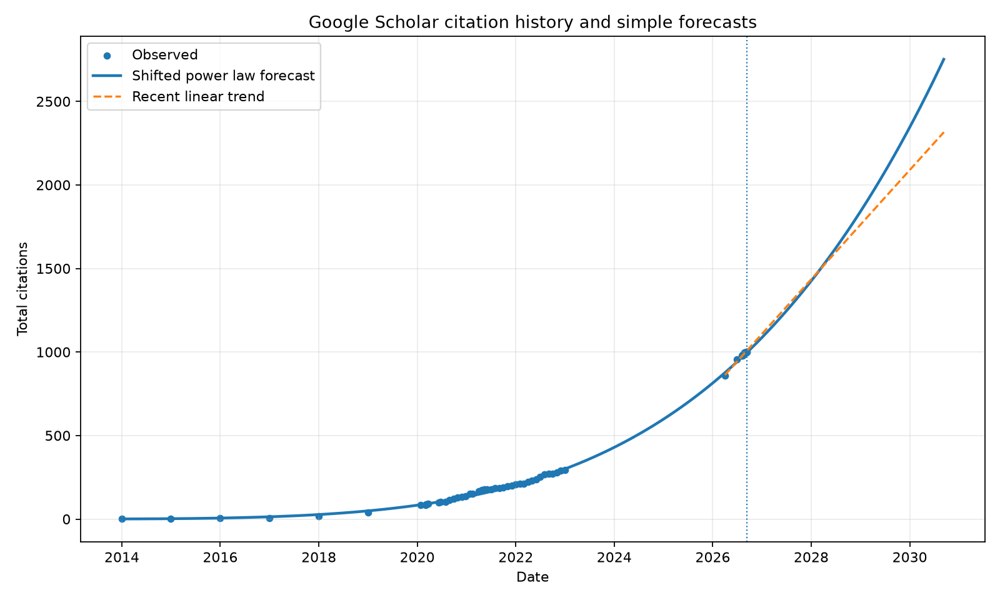

# Citation forecast

Latest observation: **1,002 citations** on 2026-09-11.

## Model comparison

| Model | Training RMSE | Backtest RMSE | 2026 | 2027 | 2028 | 2029 | 2030 |
|---|---:|---:|---:|---:|---:|---:|---:|
| Linear | 135.1 | 587.6 | 671 | 749 | 827 | 905 | 983 |
| Quadratic | 27.1 | 274.7 | 1027 | 1254 | 1503 | 1774 | 2066 |
| Exponential | 318.6 | 2774.7 | 2556 | 4336 | 7366 | 12496 | 21197 |
| Shifted power law | 9.2 | 12.8 | 1086 | 1424 | 1841 | 2344 | 2949 |

**Recommended simple extrapolation: Shifted power law.** It had the lowest RMSE when models were fit only through 2023-01-01 and then asked to predict the later 2026 observations.

As a short-term sanity check, a straight line fitted only to observations from April 2026 onward gives year-end forecasts of **2026: 1108**, **2027: 1434**, **2028: 1762**, **2029: 2089**, **2030: 2415**.

## Milestones under the recommended model

| Milestone | Approximate crossing |
|---|---|
| 1,100 | 2027-01-17 |
| 1,200 | 2027-05-12 |
| 1,500 | 2028-03-13 |
| 2,000 | 2029-05-04 |
| 2,500 | 2030-04-11 |
| 3,000 | 2031-01-28 |

## Interpretation

- The trajectory is clearly accelerating, but a literal exponential fit extrapolates far too aggressively and performs poorly in the pre-2023 backtest.
- The shifted power law captures accelerating but sub-exponential growth and currently provides the best simple long-horizon backtest among the tested forms.
- Forecast uncertainty here is dominated by model structure, publication timing, field-specific citation dynamics, and Google Scholar indexing changes. Treat the numbers as scenario estimates rather than confidence-calibrated predictions.
- The fitting series uses at most one observation per calendar month so the new three-times-per-week tracker does not overwhelm the sparse historical record.

