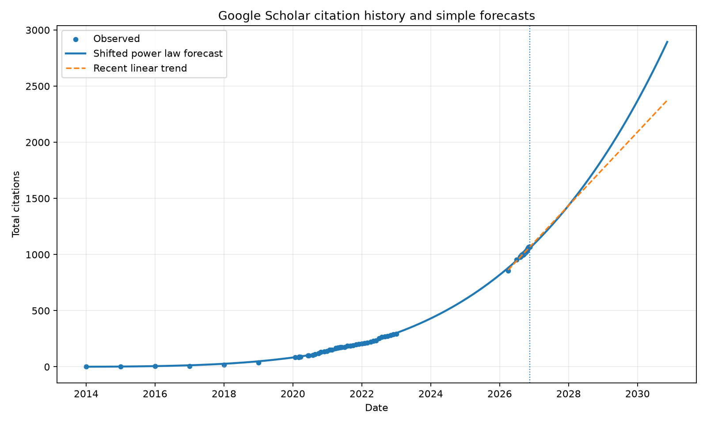

# Citation forecast

Latest observation: **1,075 citations** on 2026-11-23.

## Model comparison

| Model | Training RMSE | Backtest RMSE | 2026 | 2027 | 2028 | 2029 | 2030 |
|---|---:|---:|---:|---:|---:|---:|---:|
| Linear | 152.6 | 624.2 | 755 | 846 | 936 | 1026 | 1117 |
| Quadratic | 28.9 | 299.4 | 1053 | 1287 | 1545 | 1825 | 2127 |
| Exponential | 304.2 | 3049.7 | 2165 | 3583 | 5940 | 9834 | 16280 |
| Shifted power law | 9.4 | 13.2 | 1094 | 1436 | 1858 | 2369 | 2983 |

**Recommended simple extrapolation: Shifted power law.** It had the lowest RMSE when models were fit only through 2023-01-01 and then asked to predict the later 2026 observations.

As a short-term sanity check, a straight line fitted only to observations from April 2026 onward gives year-end forecasts of **2026: 1109**, **2027: 1437**, **2028: 1767**, **2029: 2095**, **2030: 2424**.

## Milestones under the recommended model

| Milestone | Approximate crossing |
|---|---|
| 1,100 | 2027-01-08 |
| 1,200 | 2027-05-02 |
| 1,500 | 2028-03-01 |
| 2,000 | 2029-04-19 |
| 2,500 | 2030-03-25 |
| 3,000 | 2031-01-10 |

## Interpretation

- The trajectory is clearly accelerating, but a literal exponential fit extrapolates far too aggressively and performs poorly in the pre-2023 backtest.
- The shifted power law captures accelerating but sub-exponential growth and currently provides the best simple long-horizon backtest among the tested forms.
- Forecast uncertainty here is dominated by model structure, publication timing, field-specific citation dynamics, and Google Scholar indexing changes. Treat the numbers as scenario estimates rather than confidence-calibrated predictions.
- The fitting series uses at most one observation per calendar month so the new three-times-per-week tracker does not overwhelm the sparse historical record.

